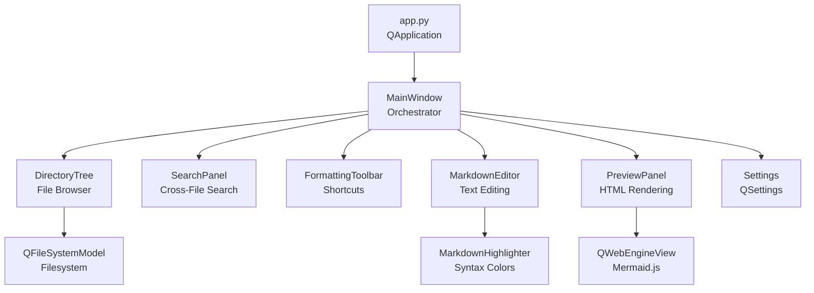
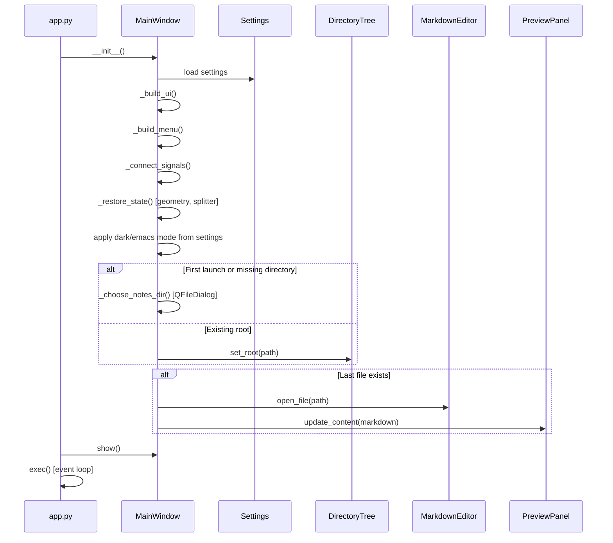
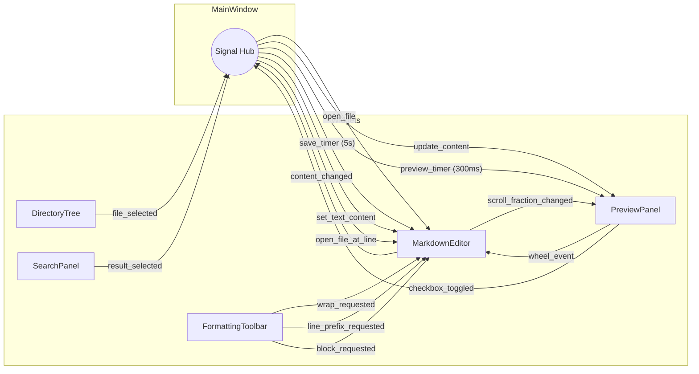
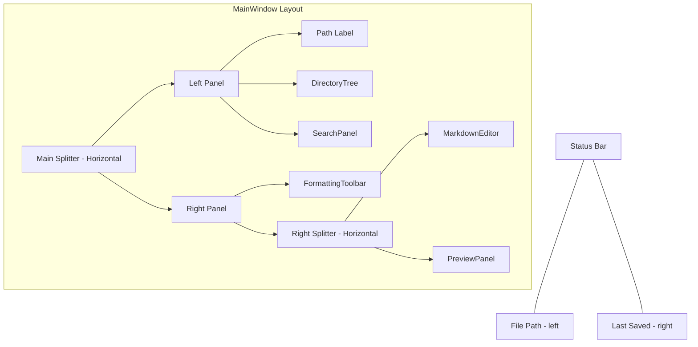
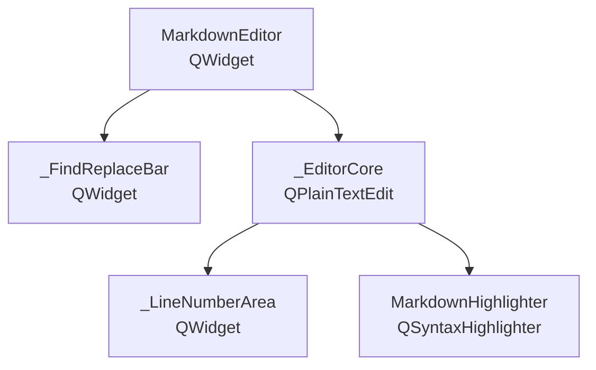
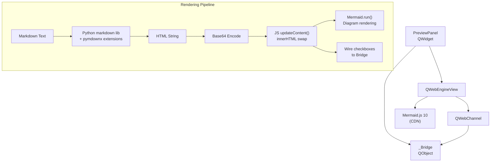
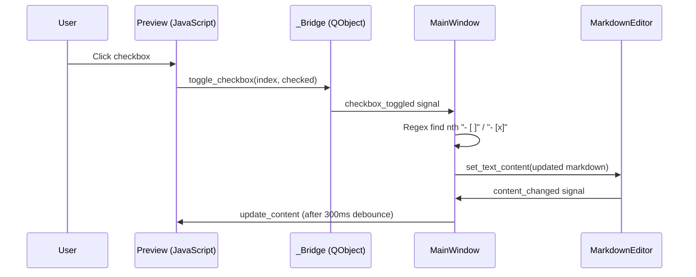

# Architecture

This document describes the architecture of DrNotes, a cross-platform desktop markdown editor built with Python and PySide6 (Qt 6).

## High-Level Overview

DrNotes follows a **widget-composition** architecture. A single `MainWindow` orchestrates four independent widget components, wiring them together with Qt signals and slots. All state persistence is delegated to a `Settings` wrapper around `QSettings`.



## Module Map

```
src/drnotes/
├── app.py                  # Entry point — creates QApplication + MainWindow
├── __main__.py             # python -m drnotes support
├── main_window.py          # MainWindow: layout, menus, signal wiring, timers
├── settings.py             # Settings: QSettings property wrapper
├── syntax_highlighter.py   # MarkdownHighlighter: regex-based syntax coloring
└── widgets/
    ├── __init__.py          # Re-exports public widget classes
    ├── editor.py            # MarkdownEditor, _EditorCore, _FindReplaceBar, _LineNumberArea
    ├── preview.py           # PreviewPanel, _Bridge, Mermaid fence formatter
    ├── directory_tree.py    # DirectoryTree: file browser with context menu
    ├── search_panel.py      # SearchPanel: cross-file full-text search
    └── toolbar.py           # FormattingToolbar: buttons + keyboard shortcuts
```

## Startup Sequence



## Signal Flow

The MainWindow acts as a mediator. Widgets never reference each other directly — all cross-widget communication flows through signals connected in `MainWindow._connect_signals()`.



### Key signal paths

| Trigger | Signal chain | Result |
|---------|-------------|--------|
| User clicks file in tree | `DirectoryTree.file_selected` → `MainWindow._open_file` | File loaded into editor, preview refreshed |
| User types in editor | `MarkdownEditor.content_changed` → 300ms debounce → `PreviewPanel.update_content` | Live preview updates |
| User types in editor | `MarkdownEditor.content_changed` → 5s debounce → `MainWindow._auto_save` | File saved to disk |
| User clicks toolbar button | `FormattingToolbar.wrap_requested` → `MarkdownEditor.insert_wrap` | Markdown formatting applied |
| User clicks checkbox in preview | `PreviewPanel.checkbox_toggled` → `MainWindow._on_checkbox_toggled` → `MarkdownEditor.set_text_content` | `- [ ]` ↔ `- [x]` toggled in source |
| User scrolls editor | `MarkdownEditor.scroll_fraction_changed` → `PreviewPanel.set_scroll_fraction` | Preview scrolls to match |
| User scrolls preview | `PreviewPanel.wheel_event` → `MarkdownEditor.adjust_scroll_by` | Editor scrolls to match |
| User double-clicks search result | `SearchPanel.result_selected` → `MainWindow._open_file_at_line` → `MarkdownEditor.goto_line` | File opened and cursor jumps to matching line |

## Widget Architecture

### MainWindow (`main_window.py`)

The central orchestrator. Responsibilities:

- **Layout**: Assembles a two-level splitter (left: directory tree, right: toolbar + editor/preview split)
- **Menus**: File (new, save, change directory, exit), Edit (find/replace, search in files), View (view modes, dark mode, emacs mode)
- **Timers**: Debounced preview refresh (300ms) and auto-save (5s)
- **Theme**: Applies a Qt stylesheet (`_QSS_DARK`) globally and propagates dark mode to child widgets
- **State persistence**: Saves/restores window geometry, splitter positions, and view mode on close/open



### MarkdownEditor (`widgets/editor.py`)

A composite widget containing three internal components:



- **`_EditorCore`** (QPlainTextEdit): The text editing surface. Handles:
  - Smart list continuation on Enter (ordered, unordered, checklists)
  - Tab/Shift+Tab indent/outdent
  - Emacs mode keybindings (20+ bindings for navigation, kill/yank, mark selection)
  - Line number gutter rendering
  - Current-line highlighting
  - Formatting insertion helpers (`insert_wrap`, `insert_line_prefix`, `insert_block`)

- **`_FindReplaceBar`**: Togglable bar with find/replace inputs, case-sensitivity toggle, and next/prev/replace/replace-all buttons. Operates directly on the `_EditorCore` via `QTextDocument.find()`.

- **`_LineNumberArea`**: Custom paint widget for the gutter, delegates rendering back to `_EditorCore.line_number_area_paint_event()`.

### PreviewPanel (`widgets/preview.py`)

Renders markdown to HTML inside a `QWebEngineView`.



**Rendering pipeline**:
1. Python `markdown` library converts markdown to HTML with extensions (superfences, tasklist, highlight, tables, tilde, nl2br, sane_lists)
2. Mermaid fenced blocks are rendered as `<pre class="mermaid-source">` by a custom superfences formatter
3. HTML is base64-encoded and injected via JavaScript `updateContent()` to avoid page reloads
4. JavaScript upgrades `.mermaid-source` elements into Mermaid diagrams via `mermaid.run()`
5. Checkboxes are wired to the `_Bridge` QObject via `QWebChannel`, which emits `checkbox_toggled` back to Python

**Scroll synchronization**: In split view, the editor emits a scroll fraction (0.0–1.0) that the preview applies proportionally. Wheel events on the preview are forwarded back to the editor via the bridge.

### DirectoryTree (`widgets/directory_tree.py`)

File browser built on `QFileSystemModel` + `QTreeView`.

- Filters to `.md` files only
- Supports drag-and-drop (internal move)
- Context menu: New Note, New Folder, Rename, Delete (with confirmation)
- Button bar at top for quick note/folder creation
- Emits `file_selected(path)` on click

### SearchPanel (`widgets/search_panel.py`)

Cross-file full-text search, togglable via `Ctrl+Shift+F`.

- Walks all `.md` files under the notes root using `os.walk()`
- Regex-based matching with optional case sensitivity
- Results displayed in a `QTreeWidget` grouped by file, with line numbers and previews
- Double-clicking a result emits `result_selected(path, line)`, which MainWindow routes to open the file and jump to the matching line
- Hidden by default; activated from the Edit menu or keyboard shortcut

### FormattingToolbar (`widgets/toolbar.py`)

A `QToolBar` that emits three signal types, connected by MainWindow to the editor:

| Signal | Purpose | Example |
|--------|---------|---------|
| `wrap_requested(prefix, suffix)` | Wrap selection | Bold: `**`, `**` |
| `line_prefix_requested(prefix)` | Prepend to line | H1: `# ` |
| `block_requested(text)` | Insert block at cursor | Code: `` ```\n\n``` `` |

### Settings (`settings.py`)

Thin property wrapper around `QSettings`. Persists:

| Property | Type | Default |
|----------|------|---------|
| `notes_root` | `str` | `""` |
| `last_file` | `str` | `""` |
| `window_geometry` | `bytes` | `b""` |
| `window_state` | `bytes` | `b""` |
| `splitter_state` | `bytes` | `b""` |
| `view_mode` | `str` | `"split"` |
| `dark_mode` | `bool` | `False` |
| `emacs_mode` | `bool` | `False` |

Storage location is platform-dependent (registry on Windows, plist on macOS, INI file on Linux under `~/.config`).

### MarkdownHighlighter (`syntax_highlighter.py`)

A `QSyntaxHighlighter` subclass with regex rules for markdown constructs: headings, bold, italic, strikethrough, inline code, links, images, blockquotes, lists, checklists, horizontal rules, and fenced code block markers. Maintains separate color palettes for light and dark themes.

## Data Flow: Checkbox Toggle

This sequence illustrates the round-trip between preview and editor when a user clicks a checkbox:



## Technology Choices

| Concern | Choice | Rationale |
|---------|--------|-----------|
| GUI framework | PySide6 (Qt 6) | Native look on all platforms, rich widget set, web engine for preview |
| Markdown → HTML | `markdown` + `pymdown-extensions` | Extensible, supports GFM features (tasklists, tables, fenced code) |
| Code highlighting | Pygments | Mature, 500+ language support, integrates with pymdownx.highlight |
| Diagram rendering | Mermaid.js 10 (CDN) | Industry standard, runs in the QWebEngineView with no extra dependencies |
| Editor ↔ Preview bridge | QWebChannel | Qt's built-in mechanism for Python ↔ JavaScript communication |
| Settings persistence | QSettings | Cross-platform, zero-config, native storage per OS |
| Packaging | PyInstaller | Single-binary output, well-tested with PySide6 |
