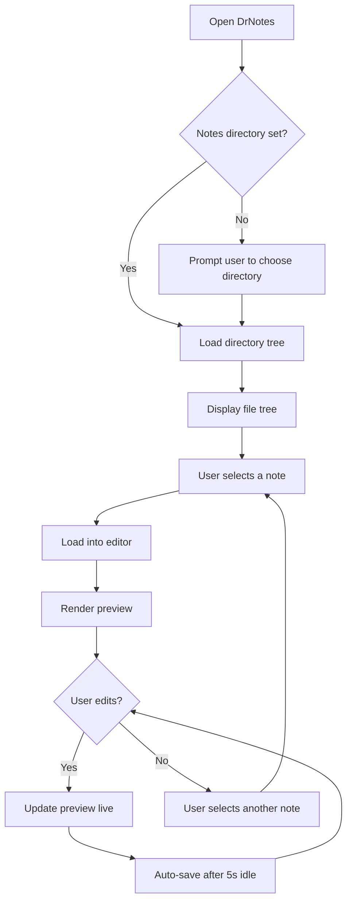
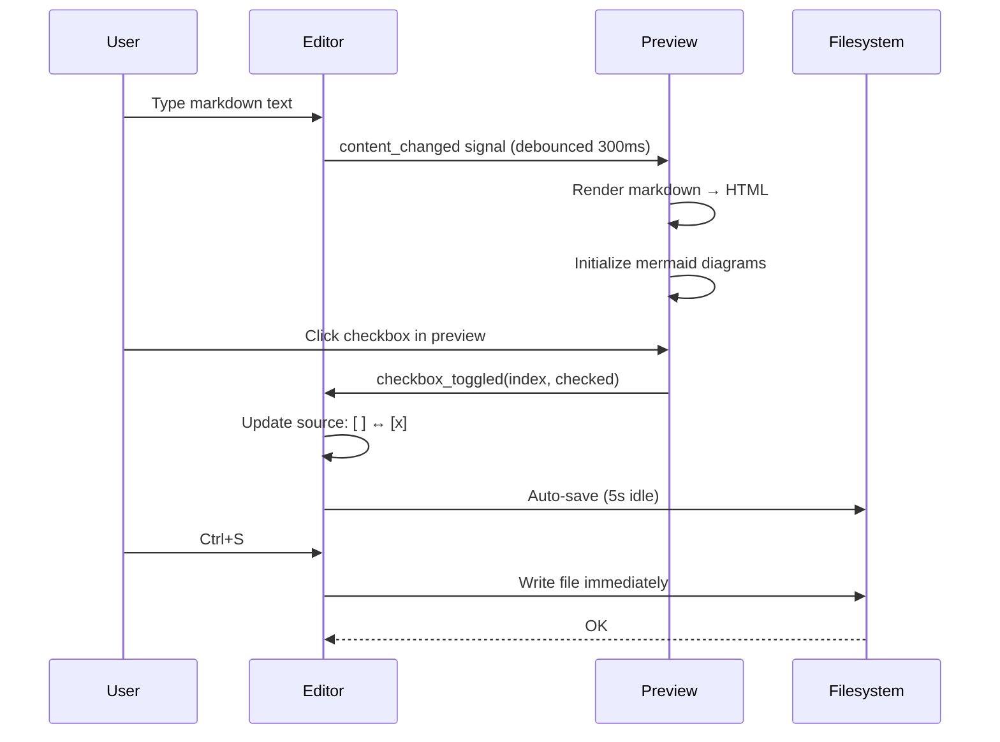
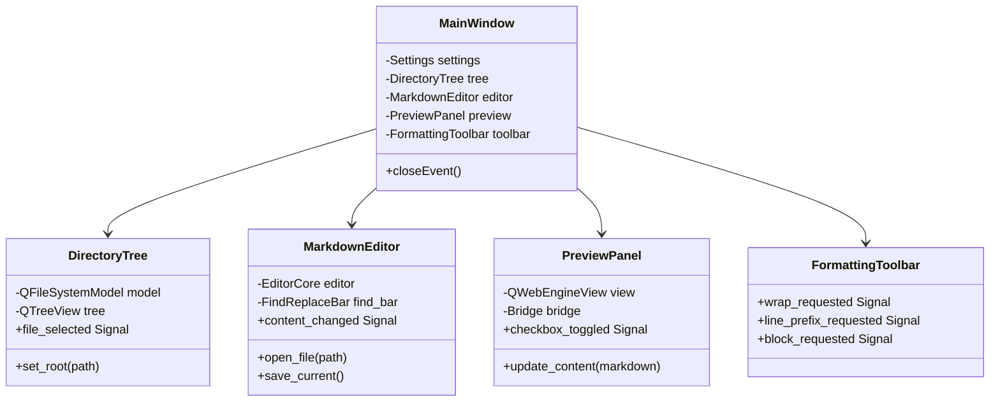
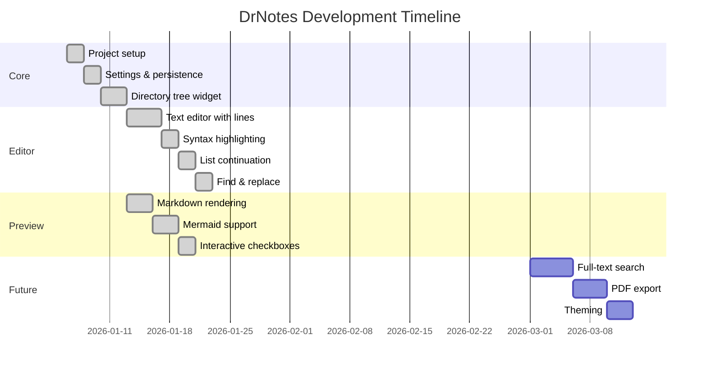
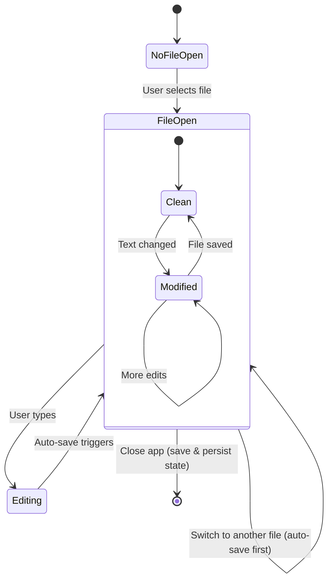
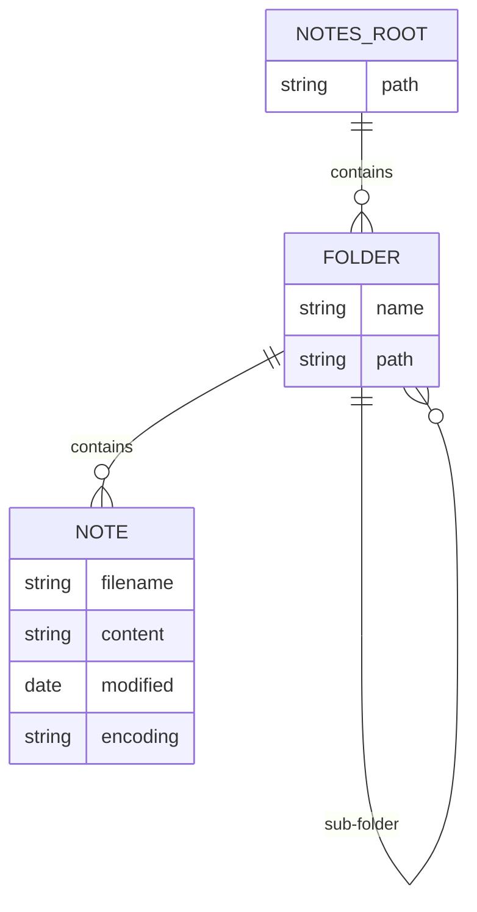
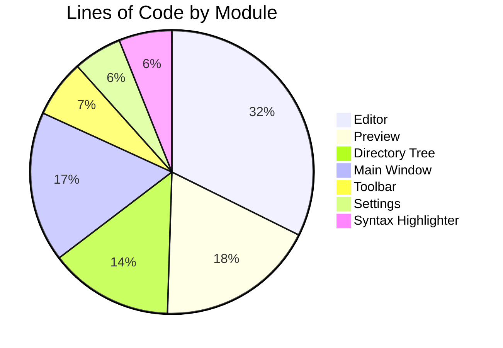

# Welcome to DrNotes

This is a sample note showcasing all supported markdown features and mermaid diagrams.

---

## Text Formatting

Here is **bold text**, *italic text*, and ***bold italic*** together. You can also use ~~strikethrough~~ for deleted content. Inline `code` looks like this.

Links work too: [Visit GitHub](https://github.com) and images can be embedded:


---

## Headings

### Third Level
#### Fourth Level
##### Fifth Level
###### Sixth Level

---

## Lists

### Unordered List

- First item
- Second item
  - Nested item A
  - Nested item B
    - Deeply nested
- Third item

### Ordered List

1. Step one
2. Step two
   1. Sub-step 2a
   2. Sub-step 2b
3. Step three

### Checklists

- [x] Write the product requirements document
- [x] Set up the project structure
- [x] Implement the markdown editor
- [x] Add full-text search
- [x] Package the app for distribution
  - [x] Linux
  - [x] macOS
  - [x] Windows

---

## Blockquotes

> "The best way to predict the future is to invent it."
> — Alan Kay

> Blockquotes can be nested:
>
> > This is a nested blockquote.
> >
> > > And a third level.

---

## Tables

| Feature         | Status      | Priority  |
|-----------------|-------------|-----------|
| Markdown Editor | Done        | Must have |
| Live Preview    | Done        | Must have |
| Mermaid Support | Done        | Must have |
| Full-text Search| Planned     | Future    |
| PDF Export      | Not started | Future    |

| Left Aligned | Center Aligned | Right Aligned |
|:-------------|:--------------:|--------------:|
| Row 1        | Data           |          100  |
| Row 2        | More data      |        2,500  |
| Row 3        | Even more      |       48,000  |

---

## Code Blocks

### Python

```python
from dataclasses import dataclass
from pathlib import Path


@dataclass
class Note:
    title: str
    path: Path
    tags: list[str]

    def word_count(self) -> int:
        text = self.path.read_text(encoding="utf-8")
        return len(text.split())

    def __str__(self) -> str:
        return f"[{', '.join(self.tags)}] {self.title} ({self.word_count()} words)"


if __name__ == "__main__":
    note = Note("Ideas", Path("ideas.md"), ["brainstorm", "draft"])
    print(note)
```

### JavaScript

```javascript
class MarkdownRenderer {
  constructor(element) {
    this.el = element;
    this.plugins = new Map();
  }

  use(name, plugin) {
    this.plugins.set(name, plugin);
    return this; // chainable
  }

  async render(source) {
    let html = this.#parseMarkdown(source);
    for (const [name, plugin] of this.plugins) {
      html = await plugin.transform(html);
    }
    this.el.innerHTML = html;
  }

  #parseMarkdown(src) {
    return src
      .replace(/^### (.+)$/gm, "<h3>$1</h3>")
      .replace(/\*\*(.+?)\*\*/g, "<strong>$1</strong>")
      .replace(/\*(.+?)\*/g, "<em>$1</em>");
  }
}
```

### Rust

```rust
use std::collections::HashMap;
use std::fs;

#[derive(Debug)]
struct NoteIndex {
    notes: HashMap<String, Vec<String>>,
}

impl NoteIndex {
    fn new() -> Self {
        Self { notes: HashMap::new() }
    }

    fn add(&mut self, tag: &str, path: &str) {
        self.notes
            .entry(tag.to_string())
            .or_default()
            .push(path.to_string());
    }

    fn search(&self, tag: &str) -> Option<&Vec<String>> {
        self.notes.get(tag)
    }
}

fn main() -> std::io::Result<()> {
    let mut index = NoteIndex::new();
    for entry in fs::read_dir("./notes")? {
        let path = entry?.path();
        if path.extension().map_or(false, |e| e == "md") {
            index.add("all", path.to_str().unwrap());
        }
    }
    println!("{:#?}", index);
    Ok(())
}
```

### SQL

```sql
CREATE TABLE notes (
    id          INTEGER PRIMARY KEY AUTOINCREMENT,
    title       TEXT NOT NULL,
    content     TEXT NOT NULL,
    folder_id   INTEGER REFERENCES folders(id),
    created_at  TIMESTAMP DEFAULT CURRENT_TIMESTAMP,
    updated_at  TIMESTAMP DEFAULT CURRENT_TIMESTAMP
);

SELECT n.title,
       f.name AS folder,
       LENGTH(n.content) AS size_chars
  FROM notes n
  JOIN folders f ON f.id = n.folder_id
 WHERE n.updated_at > DATE('now', '-7 days')
 ORDER BY n.updated_at DESC
 LIMIT 20;
```

### Bash

```bash
#!/usr/bin/env bash
set -euo pipefail

NOTES_DIR="${1:-$HOME/notes}"
QUERY="$2"

echo "Searching '$QUERY' in $NOTES_DIR ..."
grep -rn --include="*.md" --color=always "$QUERY" "$NOTES_DIR" | while IFS= read -r line; do
    file=$(echo "$line" | cut -d: -f1)
    lineno=$(echo "$line" | cut -d: -f2)
    echo "  [$file:$lineno] $(echo "$line" | cut -d: -f3-)"
done

echo "Done. $(grep -rl --include='*.md' "$QUERY" "$NOTES_DIR" | wc -l) files matched."
```

---

## Mermaid Diagrams

### Flowchart



### Sequence Diagram



### Class Diagram



### Gantt Chart



### State Diagram



### Entity Relationship Diagram



### Pie Chart



---

## Horizontal Rules

The three syntaxes all produce a rule:

---

***

___

---

## Unicode & Internationalization

DrNotes supports a wide range of Unicode characters:

### Accented & Latin Extended

- French: L'été est une saison magnifique. Ça va très bien, merci!
- German: Ärger mit Übungen — größte Straße in München
- Spanish: ¡Feliz año nuevo! ¿Cómo estás?
- Portuguese: Obrigação, coração, não,ações
- Polish: Zażółć gęślą jaźń
- Czech: Příliš žluťoučký kůň úpěl ďábelské ódy
- Turkish: Şehir içi ulaşımda değişiklik

### CJK Characters

- Chinese: 学而不思则罔，思而不学则殆。
- Japanese: 吾輩は猫である。名前はまだ無い。
- Korean: 모든 인간은 태어날 때부터 자유로우며

### Cyrillic & Greek

- Russian: Съешь ещё этих мягких французских булок, да выпей чаю.
- Ukrainian: Ґанок, їжак, єнот — ці слова мають цікаві літери.
- Greek: Ο καιρός είναι ωραίος σήμερα. Η φιλοσοφία αρχίζει με θαυμασμό.

### RTL Scripts

- Arabic: مرحباً بالعالم — هذا اختبار للنصوص العربية
- Hebrew: שלום עולם — זהו מבחן לטקסט בעברית

### Symbols & Emoji

- Arrows: ← → ↑ ↓ ↔ ⇒ ⇐ ⇔
- Math: ∀x ∈ ℝ: x² ≥ 0, ∑(i=1..n) = n(n+1)/2, √2 ≈ 1.414, ∞ × 0 ≠ 1
- Currency: $ € £ ¥ ₹ ₩ ₿ ₽
- Box drawing: ┌──┬──┐ │  │  │ └──┴──┘
- Music: ♩ ♪ ♫ ♬ 𝄞
- Misc: © ® ™ § ¶ † ‡ • ‰ ° ′ ″

### Mixed Script Table

| Language   | Greeting       | Thank you      |
|------------|----------------|----------------|
| English    | Hello          | Thank you      |
| French     | Bonjour        | Merci          |
| German     | Hallo          | Danke          |
| Japanese   | こんにちは     | ありがとう     |
| Korean     | 안녕하세요     | 감사합니다     |
| Russian    | Здравствуйте   | Спасибо        |
| Arabic     | مرحباً         | شكراً          |
| Hindi      | नमस्ते          | धन्यवाद        |
| Thai       | สวัสดี          | ขอบคุณ         |

---

## Miscellaneous

Here is a paragraph with a line break
created by trailing two spaces.

> **Tip:** Use `Ctrl+F` to open Find & Replace, and `Ctrl+S` to save.

That covers all the major markdown features supported by DrNotes!
